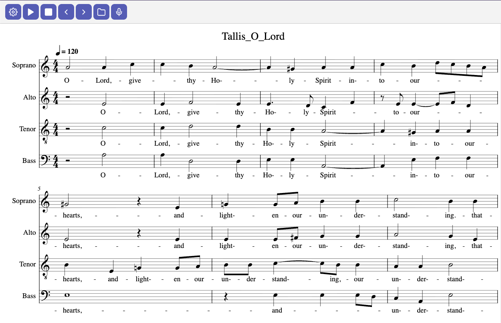

# SingerPal

A web-based application for displaying and playing musical scores encoded in [Music Encoding Initiative (MEI)](https://www.music-encoding.org/) format. On startup, it loads Thomas Tallis's *O Lord, Grant Them Peace* as a demonstration score.



## Features

- **MEI Score Rendering** — powered by [Verovio](https://github.com/rism-digital/verovio) for real-time engraving of MEI-encoded scores
- **MIDI Playback** — play scores with soundfont-based audio synthesis, including per-voice volume controls
- **Note Play on Click** — click any note to hear its pitch
- **Note Highlighting** — currently playing notes are highlighted in red during playback
- **Hover Highlighting** — hover over any note to highlight it in blue
- **Pitch Tracking** — real-time microphone pitch detection for tuning and singing practice, with visual feedback:
  - **Arrow indicator** — `↑` when sharp, `↓` when flat (displayed next to the detected note)
  - **Colored background** — the pitch info text highlights with a colored pill: red for sharp, blue for flat, green for in-tune
  - **Button glow** — the microphone button changes color with a matching glow to reflect pitch accuracy
- **Spectrum Analyzer** — live FFT frequency visualization with dominant note display
- **File Loading** — load any `.mei` file directly from your local filesystem

## Requirements

- Modern browser with support for **WebAssembly**, **AudioContext**, and **AudioWorklet** (Chrome 102+, Firefox 114+, Safari 16.4+)
- Microphone access for pitch tracking and spectrum analysis
- HTTPS or `localhost` (required by the browser for microphone and AudioWorklet APIs)

## Getting Started

The application runs entirely in the browser and requires no build step. Serve it over HTTP using any local server:

```bash
# From the project root directory
python3 -m http.server 8000
```

Then open `http://localhost:8000` in your browser.

> **Note:** Microphone access requires HTTPS or `localhost`.

## Usage

- **Play / Pause / Stop** — use the toolbar buttons to control MIDI playback
- **Per-voice volume** — open the settings panel, adjust the sliders for each voice, then press play
- **Tempo** — adjust the tempo slider in the settings panel (40–180%)
- **Pitch tracking** — click the microphone icon in the toolbar to start or stop real-time pitch detection; the detected frequency, MIDI number, and note name appear in the toolbar
- **Spectrum analyzer** — open the settings panel and click **Start** in the Spectrum section
- **Load a score** — click the folder icon to open a local `.mei` file

## Architecture

| File | Purpose |
|---|---|
| `index.html` | Page structure, toolbar, menu panel, and score display area |
| `scripts/main.js` | Application entry point: file loading, playback controls, page navigation |
| `scripts/audio.js` | Audio context setup, pitch detection, and soundfont loading |
| `scripts/score.js` | MIDI playback state machine, note rendering, and page setup |
| `scripts/spectrum.js` | Spectrum analyzer visualization and microphone enumeration |
| `scripts/state.js` | Shared application state (voice map, volume flags) |
| `scripts/pitch-processor.js` | AudioWorklet for low-latency FFT-based pitch detection |
| `scripts/midi.css` | All styles for toolbar, menu, score highlighting, and footer |

## The ecosystem

An interactive system built around semantically encoded musical notation — rather than static visual representations like PDF or scanned images — opens up a fundamentally different way of working with music. Below are three areas where this shift has significant potential.

### Richer, dynamic notation

Traditional printed scores are fixed: once engraved, they cannot change. A digital display, by contrast, can render notation that adapts in real time. Colors, annotations, and emphasis can be driven by the playback engine itself — for example, highlighting the currently sounding voice, marking phrasing boundaries as they arrive, or displaying tempo deviations as a live curve overlaid on the score. This extends naturally to pedagogical contexts, where a teacher could layer corrective annotations that appear only during rehearsal, or to performance contexts, where conductor cues and expressive markings are activated at the moment they are needed. The 5-line staff remains the shared visual language; the digital layer simply makes it responsive.

### A mineable corpus for musicology and performance studies

When a large body of classical music is encoded in a semantically rich format like MEI — where every pitch, duration, articulation, and expressive marking is a structured data element rather than a pixel on a page — the corpus becomes queryable. Researchers can search across scores for patterns that are invisible at the level of individual works: how ornamentation conventions evolved across composers and centuries, how voice-leading practices shifted between styles, or how tempo and dynamic markings correlate with formal structure. Crucially, this encoded notation can be compared against actual performance recordings, enabling systematic studies of the gap between the written score and performed music — a gap that lies at the heart of questions about interpretation, fidelity, and the limits of notation itself.

### Bridging notation and algorithmic composition

Digital notation is not only a representation of finished works; it is also a first-class data format that can be generated, transformed, and consumed by computational processes. This means that algorithmic and mathematically driven compositional methods — from procedural generation and Markov models to deep-learning-based music synthesis — can output directly into the same notation framework that human composers and performers already use. The result is a two-way bridge: algorithmic processes produce readable, performable scores, and existing encoded scores become input material for computational analysis, variation, and re-composition. Over time, this convergence could expand the palette of both human and machine-driven musical creation.

## Known Issues

- Verovio is pinned to release 5.7 due to an automatic paging bug in later versions that disrupts playback.
- Verovio's MIDI rendering does not handle repeats correctly.
- Pitch tracking is still experimental and may produce inaccurate results in noisy environments.
- When clicking a note to hear its pitch, aim for the junction of the note stem and note head for reliable detection.
- To adjust per-voice volumes, stop playback, move the sliders, then press play again.

## Notes

- Pre-rendered SoundFonts are bundled directly into the repository to minimize network fetches and allow offline use.

## Acknowledgements

This project uses the following open-source libraries:

- **[Verovio](https://github.com/rism-digital/verovio)** — MEI rendering engine, by the RISM Digital Center
- **[Pre-rendered SoundFonts](https://github.com/gleitz/midi-js-soundfonts)** — by Benjamin Gleitzman
- **[SoundFont Player](https://github.com/danigb/soundfont-player)** — by Daniel García Buhrer

Much of this project was developed using AI-assisted ("vibe") coding.

## License

MIT — see [LICENSE](LICENSE) for details.
